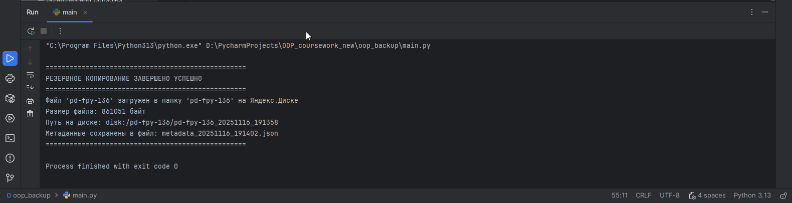
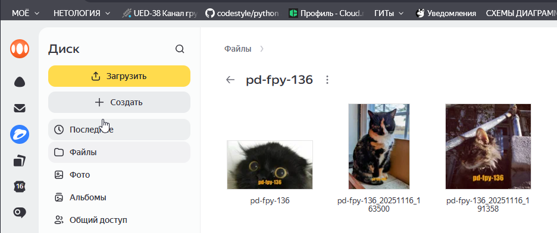
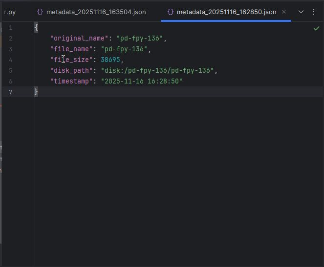

# Курсовая работа "Резервное копирование"

Программа загружает изображения кошек с cataas.com на Яндекс.Диск.

## Требования задания

- Получение картинок с API cataas.com.
- Папка на Яндекс.Диске: `pd-fpy-136`.
- Имя файла = название группы = `pd-fpy-136`.
- Сохранение метаданных в JSON.
- Входные данные: текст, токен Яндекс.Диска.
- Выходные данные: файл на диске, JSON-файл.

## Обязательные требования

- REST API Яндекс.Диска, токен с полигона.
- Создание папки на диске.
- Загрузка "по воздуху".
- Прогресс-бар или логирование.
- PEP8, отдельный репозиторий, `requirements.txt`.

## Технологии

Python 3.13, requests, tqdm, logging.

## Структура проекта
```
oop_backup/
├── cat_api.py
├── yandex_disk.py
├── backup_manager.py
├── metadata_manager.py
├── main.py
├── settings.py
├── cookie.py
├── requirements.txt
├── .gitignore
└── README.md
```

## Примеры работы





## Результат

Изображение сохранено в папку `pd-fpy-136` на Яндекс.Диске.

Ссылка на Яндекс.Диск: [https://disk.yandex.ru/client/disk/pd-fpy-136](https://disk.yandex.ru/client/disk/pd-fpy-136)